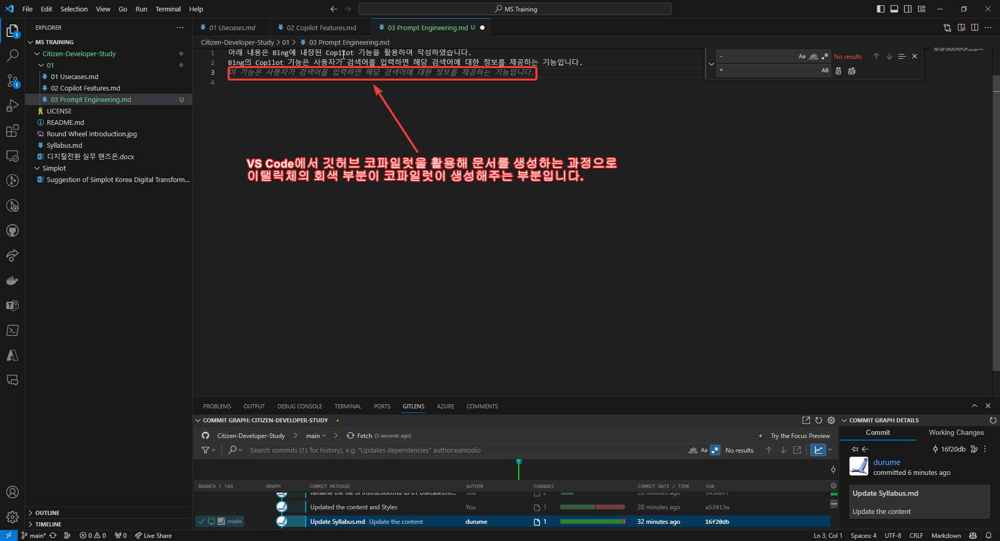

아래 내용은 Bing에 내장된 Copilot 기능을 활용하여 작성하였습니다.
Bing의 Copilot 기능은 사용자가 검색어를 입력하면 해당 검색어에 대한 정보를 제공하는 기능입니다.

아래 이미지처럼 깃허브 코파일럿이 문서 생성을 자동으로 도와주고 있습니다.

다음 내용은 Bing의 Copilot 기능을 활용하여 **프롬프트 엔지니어링**에 대해 블로그 형태로 작성하라고 하고 받은 결과입니다.
> 프롬프트 엔지니어링이란 무엇일까요? 프롬프트 엔지니어링은 인공지능(AI) 시스템에게 특정한 결과물을 만들도록 입력값이나 '프롬프트'를 작성하고, 개선하고, 최적화하는 과정입니다. 프롬프트 엔지니어링은 AI 모델이 언어뿐만 아니라 질문의 뉘앙스와 의도도 이해할 수 있도록 도와줍니다. 좋은 프롬프트는 좋은 결과를 가져옵니다. 프롬프트 엔지니어링의 예시로는 ChatGPT나 DALL-E 같은 생성형 AI 서비스를 사용할 때 자연어로 입력하는 것이 있습니다. 예를 들어, ChatGPT를 사용해서 이력서에 들어갈 자기소개서를 작성하고 싶다면, '마케팅 분석가를 위한 자기소개서 샘플을 작성해주세요'라고 입력할 수 있습니다. 그리고 ChatGPT의 응답에 대해 '너무 공식적이다'나 '100단어 이내로 줄여주세요'와 같은 피드백을 줄 수 있습니다. DALL-E 같은 이미지 생성 모델에서도 비슷한 방식으로 프롬프트 엔지니어링을 할 수 있습니다.

#깃허브 코파일럿(github copilot)으로 챗지피티를 통해 프롬프트 엔지니어링에 관해 문서 작성하기

## 챗지피티를 통해 프롬프트 엔지니어링을 하는 방법

1. 챗지피티에 접속합니다.
2. 챗지피티에게 원하는 결과물을 만들도록 입력값이나 '프롬프트'를 작성합니다.
3. '프롬프트' 작성에 어려움을 겪으면 챗지피티에게 도움을 요청합니다.
4. 챗지피티가 생성한 결과물을 확인하고, 만족스럽지 않다면 피드백을 줍니다.
5. 챗지피티가 생성한 결과물을 수정하고, 만족스럽다면 결과물을 저장합니다.
6. 저장한 결과물을 활용하여 다양한 작업을 수행합니다.

## 프롬프트 엔지니어링을 통해 얻을 수 있는 이점

1. AI 모델이 언어뿐만 아니라 질문의 뉘앙스와 의도도 이해할 수 있도록 도와줍니다.
2. 좋은 프롬프트는 좋은 결과를 가져옵니다.
3. 사용자가 원하는 결과물을 쉽게 얻을 수 있습니다.
4. 사용자가 원하는 결과물을 쉽게 수정할 수 있습니다.
5. 사용자가 원하는 결과물을 쉽게 저장할 수 있습니다.
6. 사용자가 원하는 결과물을 쉽게 활용할 수 있습니다.  

## 프롬프트 엔지니어링을 통해 얻을 수 있는 단점

1. 사용자가 원하는 결과물을 얻기 위해 시간이 소요될 수 있습니다.
2. 사용자가 원하는 결과물을 얻기 위해 노력이 필요할 수 있습니다.
3. 사용자가 원하는 결과물을 얻기 위해 기술적인 지식이 필요할 수 있습니다.
4. 사용자가 원하는 결과물을 얻기 위해 비용이 발생할 수 있습니다.

## 프롬프트 엔지니어링을 통해 얻을 수 있는 기대효과

1. 사용자가 원하는 결과물을 쉽게 얻을 수 있어서 생산성이 향상될 수 있습니다.
2. 사용자가 원하는 결과물을 쉽게 수정할 수 있어서 효율성이 향상될 수 있습니다.
3. 사용자가 원하는 결과물을 쉽게 저장할 수 있어서 안정성이 향상될 수 있습니다.

## 프롬프트 엔지니어링을 통해 얻을 수 있는 기대효과

1. 사용자가 원하는 결과물을 쉽게 활용할 수 있어서 경쟁력이 향상될 수 있습니다.  
2. 사용자가 원하는 결과물을 쉽게 활용할 수 있어서 창의성이 향상될 수 있습니다.  
3. 사용자가 원하는 결과물을 쉽게 활용할 수 있어서 혁신성이 향상될 수 있습니다.
4. 사용자가 원하는 결과물을 쉽게 활용할 수 있어서 성과가 향상될 수 있습니다.
5. 사용자가 원하는 결과물을 쉽게 활용할 수 있어서 가치가 향상될 수 있습니다.
6. 사용자가 원하는 결과물을 쉽게 활용할 수 있어서 만족도가 향상될 수 있습니다.
7. 사용자가 원하는 결과물을 쉽게 활용할 수 있어서 효과가 향상될 수 있습니다.

깃허브 코파일럿을 활용해서 위와 같은 문서를 '탭(Tab)'과 '엔터(Enter)' 키만 눌러가며 작성해 봤습니다.

## 진행과정 캡처화면은 아래 이미지와 같습니다.
  
최초 "챗지피티를 통해 프롬프트 엔지니어링을 하는 방법"이라는 제목을 스스로 생성하고, 이에 만족하면 '탭'과 '엔터'만으로 문서를 작성합니다.  

  
이어서 쭉 '탭'과 '엔터'를 통해 따라가면 마지막에는 비슷한 내용만 나오는데, 해당 내용은 챗지피티와 달리 '탭'과 '엔터'만으로 작성한 것이어서 프롬프트를 통해 생성하는 것과 달라서 차이가 있습니다.

# 챗지피티에서 프롬프트 엔지니어링 해보기 실습

[챗지피티로 이동](https://chat.openai.com)

# '빙(Bing)' 코파일럿에서 프롬프트 엔지니어링 해보기 실습
> 주의: '빙(Bing)'의 코파일럿은 Edge 브라우저에서 최적화 되어 있습니다.
 

[빙 코파일럿으로 이동](https://www.bing.com/copilot)

