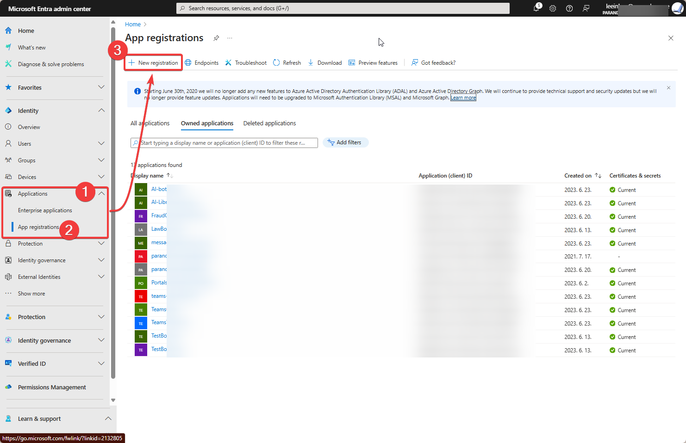
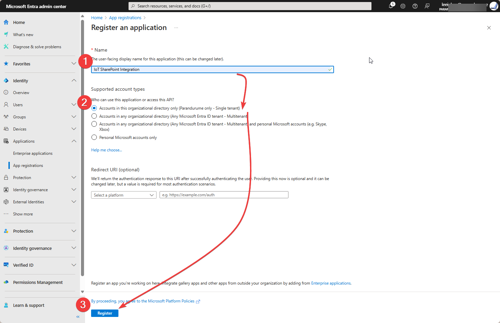
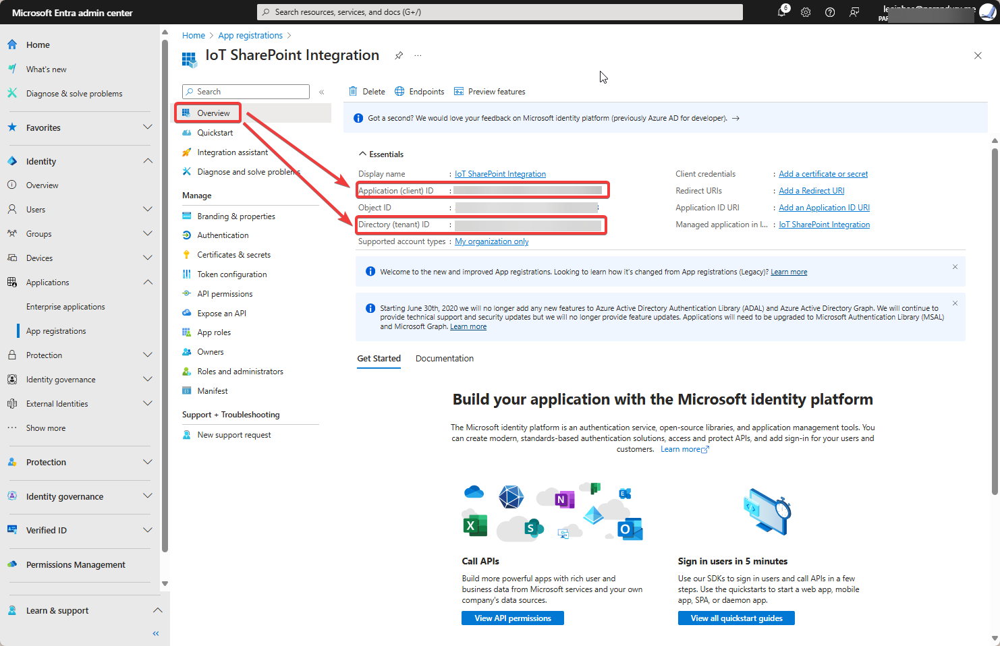
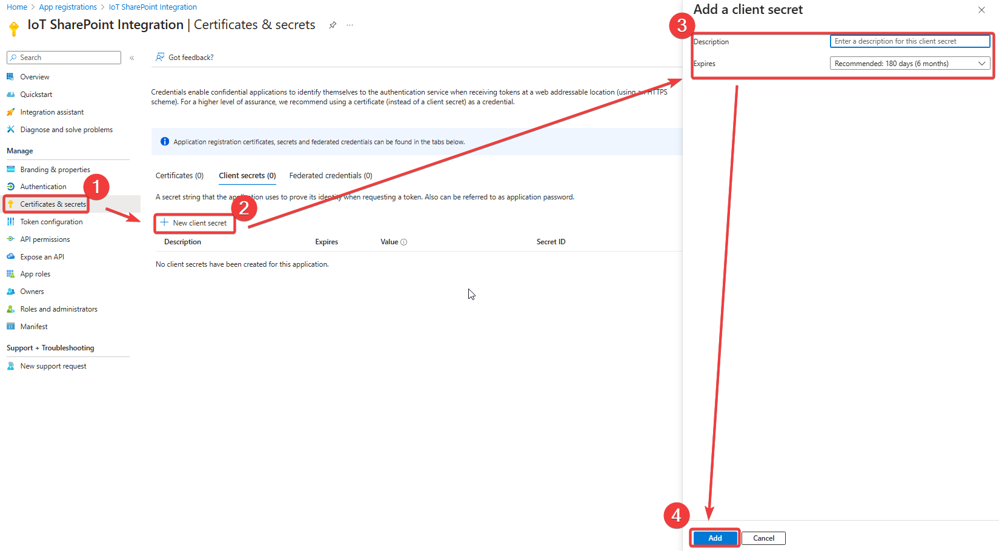
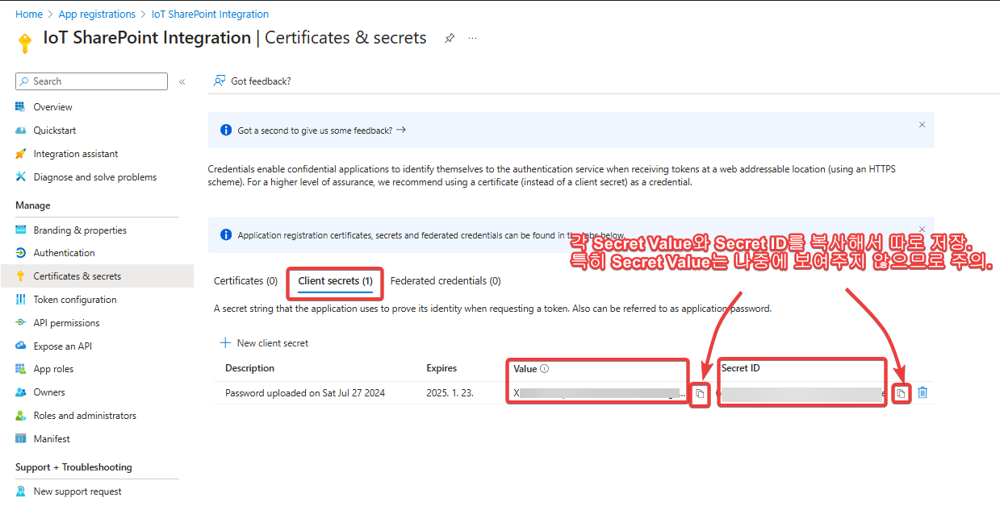
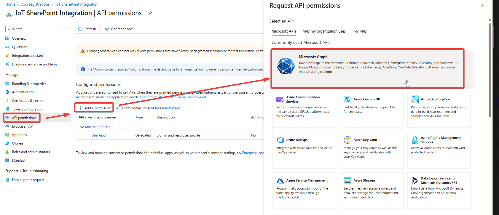
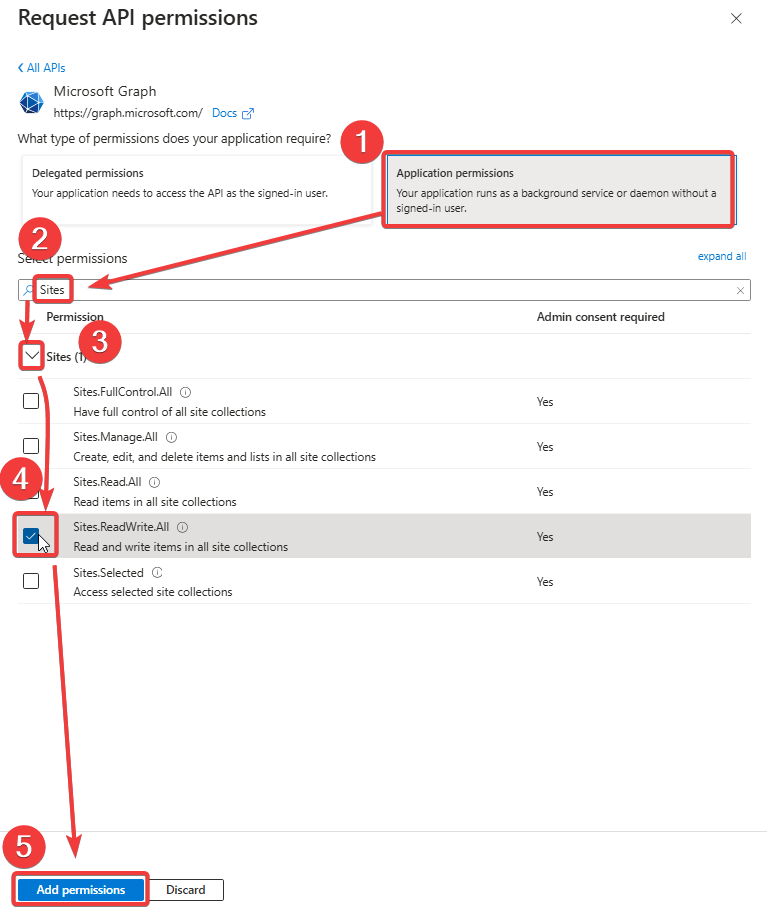
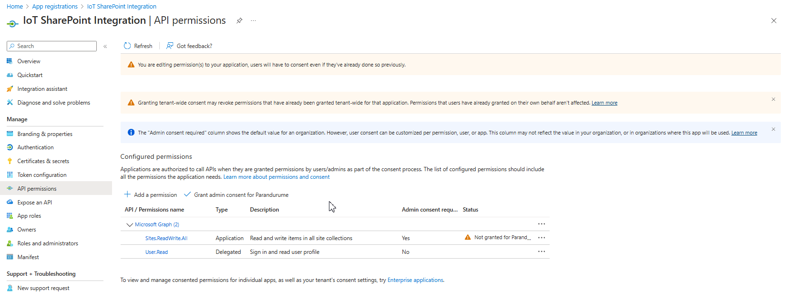
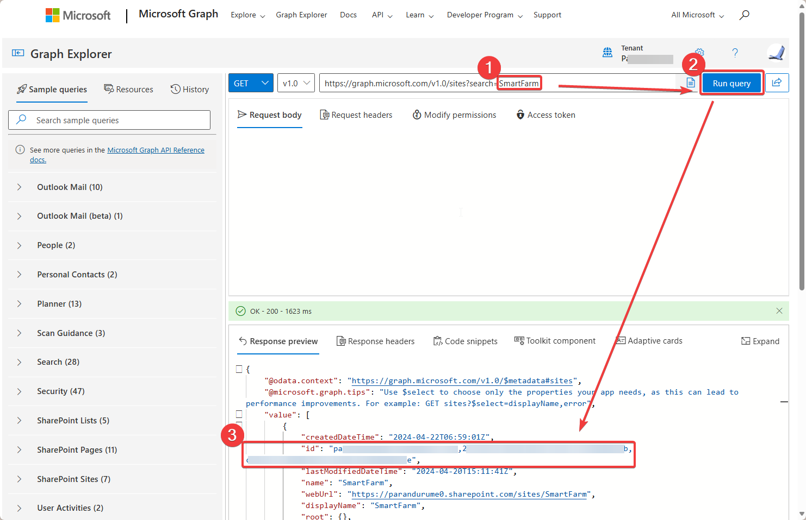
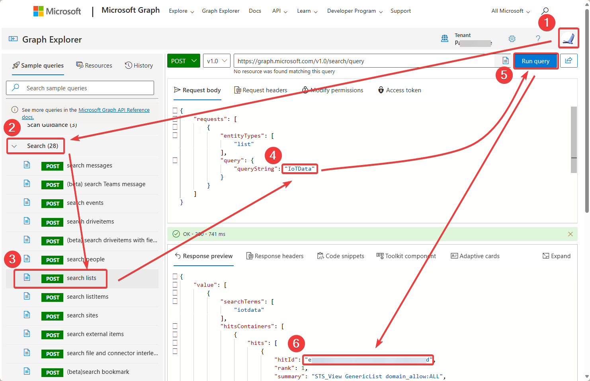

# Raspberry Pi와 SharePoint List 통합하기
## 1. SharePoint List란?
SharePoint List는 Microsoft SharePoint에서 제공하는 데이터 저장 및 관리를 위한 서비스입니다. List는 테이블 형식으로 구성되어 있으며, 각각의 열은 필드로서 데이터를 저장합니다. 이를 통해 사용자는 다양한 유형의 데이터를 구성하고 관리할 수 있습니다.  

SharePoint List의 활용은 다양합니다. 몇 가지 예시로는:
- 문서 라이브러리: 문서를 업로드하고 버전 관리, 공유 및 액세스 제어를 할 수 있습니다.
- 작업 관리: 작업 목록을 생성하여 팀원 간의 작업 할당, 진행 상황 추적 및 우선순위 설정이 가능합니다.
- 문제 추적: 문제 목록을 생성하여 문제 보고, 해결 상태 추적 및 팀 간 협업이 가능합니다.

SharePoint List는 사용자가 비즈니스 프로세스를 자동화하고 효율적으로 관리할 수 있는 강력한 도구입니다.

## 2. SharePoint List를 데이터베이스로 활용하는 까닭?

SharePoint List를 데이터베이스로 활용하는 이유는 여러 장점이 있습니다. 

첫째로, Raspberry Pi를 통해 DHT11 센서로부터 수집한 데이터를 SharePoint List에 저장하는 것은 간이성을 제공합니다. SharePoint List는 테이블 형식으로 구성되어 있어 데이터를 쉽게 구성하고 관리할 수 있습니다. 따라서, 센서로부터 수집한 데이터를 간단하게 필드에 저장하여 효율적으로 관리할 수 있습니다.

둘째로, SharePoint List는 Power Platform과의 손쉬운 연동을 가능하게 합니다. Power Platform은 Microsoft의 비즈니스 앱 플랫폼으로, 간단한 앱 및 워크플로우를 만들고 자동화할 수 있습니다. Raspberry Pi로부터 수집한 데이터를 SharePoint List에 저장하면, Power Platform을 사용하여 이 데이터를 활용하여 다양한 앱 및 워크플로우를 개발할 수 있습니다. 이를 통해 비즈니스 프로세스를 자동화하고 효율적으로 관리할 수 있습니다.

따라서, 우리는 이번에 손쉬운 데모를 위해서 Raspberry Pi를 통해 수집한 데이터를 간이성과 Power Platform과의 손쉬운 연동 등을 이유로 SharePoint List에 저장하기로 하겠습니다.

다만, 실무에서 활욯할 때에는 SharePoint의 속도, 보안 등의 취약점도 고려할 필요가 있습니다.

## 라즈베리 파이를 통한 사물인터넷(IoT)과 쉐어포인트 목록(SharePoint List) 통합

이 실습을 통해서 라즈베리 파이를 사용하여 DHT11 센서에서 읽어들인 데이터를 쉐어포인트 목록에 저장하는 것을 해볼 수 있습니다. 데이터 통합에는 마이크로소프트(Microsoft) 그래프(Graph)를 활용하도록 하겠습니다. 

### 사전 준비사항

- 라즈베리 운영체제가 설치된 라즈베리 파이
- DHT11 센서(온/습도)
- SharePoint 온라인 계정
- 마이크로소프트 엔트라(Entra) 계정
- Microsoft 365 계정
- 파이선(Python) 설치
- 설치할 라이브러리들 또는 패키지: `adafruit-circuitpython-dht`, `requests`, `schedule`, `msal`

### Step 1: 하드웨어 설정

1. **DHT11 센서 라즈베리 파이와 연결**:
   - DHT11의 VCC pin을 라즈베리 파이의 3.3V (또는 5V) pin 에 연결.
   - DHT11의 GND pin을 라즈베리 파이의 GND pin에 연결.
   - DHT11의 Data pin을 라즈베리 파이의 GPIO pin 4에 연결.

2. **작업 폴더 생성 및 가상환경 설정**
프로젝트용 작업 폴더(디렉토리)를 만든 후, 해당 폴더로 이동해서 가상환경을 설치하는 명령어입니다.   
```bash
mkdir IoT_Project
cd IoT_Project
python3 -m venv iot
source iot/bin/activate
```
위와 같이 가상환경을 설치하는 까닭은 기존 시스템의 라이브러리 또는 패키지 등과 충돌을 막고 안정적인 개발을 하기 위해서입니다.  

위 예저는 'IoT_Project'라는 폴더(디렉토리)를 만든 후에(mkdir), 새로 생긴 디렉토리로 이동해서(cd), 파이선 스크립트로 'iot'라는 가상환경을 만든 후 해당 가상환경을 실행하는 내용입니다.  

참고로 가상환경을 해제하고 싶은 경우 ```deactivate```라는 명령어를 터미널에서 실행하면 됩니다.

### Step 2: 필수 라이브러리(또는 패키지) 설치

```bash
pip install adafruit-circuitpython-dht
pip install requests
pip install schedule
pip install msal
```

### Step 3: Entra Admin Center에서 앱 등록
1. [Entra Admin Center](https://entra.microsoft.com)으로 이동해서 왼쪽 메뉴에서 앱 등록(Applications>App registrations)
3. 새 등록(New registration)을 클릭.

4. 필수 사항 채워넣기:
- Name: 원하는 앱 이름 입력(예를 들어 'IoT SharePoint Integration')
- Supported account types: Accounts in this organizational directory only (Single tenant)

5. 등록(Register) 후 등록된 앱 중요 정보 확인.

6. Certificates & secrets > New client secret 한 다음 create a new secret. 해당 Value를 꼭 복사해서 저장해두어야 합니다.  
  
**```주의```생성할 때 보여주고 다음에는 안 보여줍니다. 잘 저장해둬야 합니다.**  


7. API permissions > Add a permission > Microsoft Graph > Application permissions 순으로 처리합니다.  

8. Add the permissions을 처리할 때 :
- Sites.ReadWrite.All

9. 마무리 한 다음 생성된 permission에 대해서 Grant admin consent for the permissions도 마무리 해주세요.
]

### Step 4: 애플리케이션 구성(Configure the Application)
config.py 라는 파일을 생성해서 Entra에 등록된 앱에 관한 정보를 각각 입력한 다음 해당 파일을 저장합니다:
```bash
# config.py

CLIENT_ID = "your-client-id"  # 등록한 앱의 애플리케이션(클라이언트) ID
CLIENT_SECRET = "your-client-secret-value"  # 앱을 등록할 때 추가한 Secret Value(생성할 때만 보여주므로 저장 필수)
TENANT_ID = "your-tenant-id"  # 등록한 앱의 Tenant ID 정보 (Overview에서 확인 가능)
AUTHORITY = f'https://login.microsoftonline.com/{TENANT_ID}'
SCOPE = ["https://graph.microsoft.com/.default"]
```

### Step 5: 파이선 스크립트 작성

DHT11 센서에서 취득한 온/습도 정보를 MSAL 이라는 방식의 인증을 통해서 마이크로소프트(Microsoft)가 제공하는 그래프(Graph) 서비스를 통해 쉐어포인트(SharePoint) 목록(List)에 데이터를 저장하는 파이선 스크립트를 만들어 보겠습니다. 참고로 저는 'dht11_to_sharepoint_msal.py'라는 이름으로 파일을 만들어서 저장하기로 합니다.  

먼저 [MS Graph explorer (https://developer.microsoft.com/en-us/graph/graph-explorer)](https://developer.microsoft.com/en-us/graph/graph-explorer) 라는 곳으로 이동합니다.

해당 파이썬 스크립트에서 사용할 SharePoint List의 ID와 해당 목록(List)가 저장된 SharePoint Site의 ID를 찾아오겠습니다.  

- 쉐어포인트 사이트(SharePoint Site) ID 찾기  


- 쉐어포인트 목록(SharePoint List) ID 찾기  



위에서 찾은 각 ID를 아래 파이선 스크립트에 복사해서 붙여넣도록 하겠습니다.

```python
import time
import board
import adafruit_dht
import requests
from datetime import datetime
import schedule
import msal
from config import CLIENT_ID, CLIENT_SECRET, AUTHORITY, SCOPE

# DHT11 sensor initialization
dhtDevice = adafruit_dht.DHT11(board.D4)

# SharePoint settings
SHAREPOINT_SITE_ID = "your-sharepoint-site-id" # MS Graph explorer 에서 찾은 Site id 복사해서 쌍따옴표 안에 붙여넣기
SHAREPOINT_LIST_ID = "your-sharepoint-list-id" # MS Graph explorer에서 찾은 List id 역시 복사해서 붙여넣기

def get_access_token():
    app = msal.ConfidentialClientApplication(
        CLIENT_ID,
        authority=AUTHORITY,
        client_credential=CLIENT_SECRET,
    )

    # First, look for a token in the cache
    result = app.acquire_token_silent(SCOPE, account=None)

    if not result:
        print("No suitable token exists in cache. Getting a new one from AAD.")
        result = app.acquire_token_for_client(scopes=SCOPE)

    if "access_token" in result:
        return result["access_token"]
    else:
        raise Exception("Could not acquire token: " + result.get("error") + ", " + result.get("error_description"))

def read_dht11():
    try:
        temperature_c = dhtDevice.temperature
        humidity = dhtDevice.humidity
        print(f"Read from sensor - Temp: {temperature_c} C, Humidity: {humidity}%")
        return temperature_c, humidity
    except RuntimeError as error:
        print(f"Sensor reading error: {error.args[0]}")
        return None, None

def save_to_sharepoint(temp, hum):
    access_token = get_access_token()
    headers = {
        "Authorization": "Bearer " + access_token,
        "Content-Type": "application/json"
    }
    data = {
        "fields": {
            "Title": datetime.now().strftime("%Y-%m-%d %H:%M:%S"),
            "Temperature": temp,
            "Humidity": hum
        }
    }
    response = requests.post(
        f"https://graph.microsoft.com/v1.0/sites/{SHAREPOINT_SITE_ID}/lists/{SHAREPOINT_LIST_ID}/items",
        headers=headers,
        json=data
    )
    if response.status_code == 201:
        print("Data saved to SharePoint successfully.")
    else:
        print(f"Failed to save data to SharePoint: {response.text}")

def job():
    print("Starting job...")
    temp, hum = read_dht11()
    if temp is not None and hum is not None:
        save_to_sharepoint(temp, hum)
    print("Job finished.")

# 매 30분마다 확인 후 저장하는 스케줄
schedule.every(30).minutes.do(job) 

print("Script started. Waiting for the first job to run...")
# Run the job immediately for testing
job()

while True:
    schedule.run_pending()
    print("Checking schedule at:", datetime.now())
    time.sleep(900)  # 15분간 스케줄 상황 대기
```
### Step 6: 파일 저장 및 실행
위 파이선 스크립트를 저장한 다음 터미널에서 실행을 진행합니다.

```bash
python3 dht11_to_sharepoint_msal.py
```

위와 같이 실행하면 문제없이 DHT11 센서를 통해서 Raspberry Pi가 해당 SharePoint 사이트의 목록에 값을 처음 저장한 다음 30분마다 저장하게 됩니다.