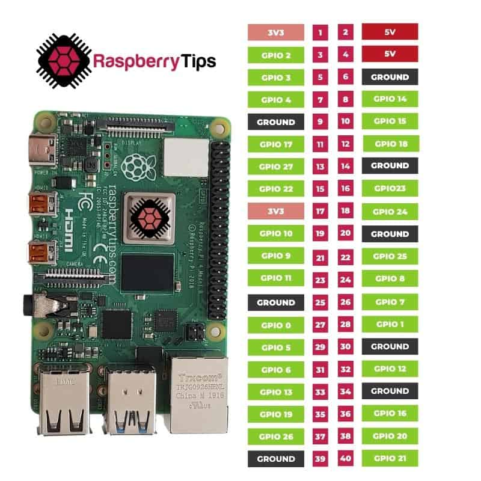
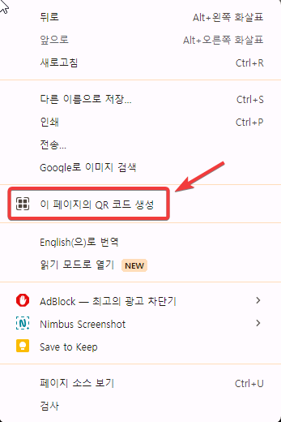

# IoT 초보를 위한 Flask 및 Ngrok 사용 웹 서버 구축 가이드

이 가이드는 Flask 및 Ngrok을 사용하여 온도 및 습도 데이터를 표시하는 웹 서버를 라즈베리 파이에서 설정하는 방법을 단계별로 설명합니다.  
해당내용은 생성형 인공지능(GenAI)인 챗지피티를 활용해 만든 커리큘럼입니다.  

## 1단계: 라즈베리 파이 및 DHT11 설정

### 1. 라즈베리 파이에 Raspbian 설치 (Windows 머신 사용)

- **필요한 재료**: 라즈베리 파이, microSD 카드 (32GB 권장), 전원 공급 장치, HDMI 케이블, 키보드, 마우스, 모니터, Windows PC.
- **단계**:
    1. <a href="https://www.raspberrypi.org/software/" target="_blank">라즈베리 파이 공식 다운로드 페이지</a>로 이동합니다.
    2. "Raspberry Pi Imager"를 다운로드하여 설치합니다. Windows용 설치 파일을 선택하십시오.
    3. Raspberry Pi Imager를 실행합니다.
    4. "Choose OS" 버튼을 클릭하고 "Raspberry Pi OS (32-bit)"를 선택합니다.
    5. "Choose SD Card" 버튼을 클릭하고 microSD 카드를 선택합니다.
    6. "Write" 버튼을 클릭하여 Raspbian OS를 microSD 카드에 설치합니다.
    7. 완료되면 microSD 카드를 라즈베리 파이에 삽입합니다.
    8. 라즈베리 파이를 모니터, 키보드 및 마우스에 연결하고 전원을 켭니다.
    9. 초기 설정을 완료합니다.

### 2. 한국어 언어 패키지 설치 및 설정

- **라즈베리 파이에서 터미널을 엽니다.**
- 다음 명령어를 실행하여 한국어 언어 패키지를 설치합니다:
    ```bash
    sudo apt update
    sudo apt install -y fonts-unfonts-core
    sudo apt install -y ibus ibus-hangul
    sudo apt install -y language-pack-ko
    sudo apt install -y manpages-ko
    ```

- 키보드 입력기를 설정합니다:
    ```bash
    ibus-setup
    ```

    - "Input Method" 탭에서 "Add" 버튼을 클릭하고 "Korean - Hangul"을 선택합니다.

- 시스템 언어를 한국어로 변경합니다:
    ```bash
    sudo raspi-config
    ```

    - "Localisation Options"를 선택하고 "Change Locale"을 선택합니다.
    - "ko_KR.UTF-8 UTF-8"을 선택하고 "OK"를 클릭합니다.
    - 기본 로케일을 "ko_KR.UTF-8"로 설정합니다.

- 시스템을 재부팅합니다:
    ```bash
    sudo reboot
    ```

### 3. DHT11 센서 연결 및 구성

- **필요한 재료**: DHT11 센서, 점퍼 와이어, 브레드보드.
- **배선**:
    - DHT11의 VCC 핀을 라즈베리 파이의 3.3V에 연결합니다.
    - DHT11의 GND 핀을 라즈베리 파이의 GND에 연결합니다.
    - DHT11의 데이터 핀을 라즈베리 파이의 GPIO4에 연결합니다.  



- **Python 스크립트**:
    ```python
    import Adafruit_DHT
    import time

    # 센서 유형 및 GPIO 핀 설정
    sensor = Adafruit_DHT.DHT11
    pin = 4

    while True:
        humidity, temperature = Adafruit_DHT.read(sensor, pin)
        if humidity is not None and temperature is not None:
            print(f'Temperature: {temperature}C  Humidity: {humidity}%')
        else:
            print('Failed to get reading. Try again!')
        time.sleep(10)
    ```

### 4. 라즈베리 파이의 IP 주소 찾기

- 라즈베리 파이에서 터미널을 엽니다.
- 다음 명령어를 실행하여 IP 주소를 찾습니다:
    ```bash
    hostname -I
    ```
- 표시된 IP 주소를 기록해 둡니다. 이 주소는 동일 네트워크의 다른 장치에서 Flask 웹 서버에 접속하는 데 사용됩니다.

## 2단계: Flask를 사용한 웹 서버 설정

### 1. 라즈베리 파이에 Flask 및 Adafruit_DHT 설치

- 터미널을 열고 다음 명령어를 실행합니다:
    ```bash
    sudo apt update
    sudo apt install python3-pip python3-venv vim
    ```

- 프로젝트 디렉토리를 생성하고 가상 환경을 설정합니다:
    ```bash
    mkdir flask_app
    cd flask_app
    python3 -m venv venv
    source venv/bin/activate
    ```

- 가상 환경에 Flask 및 Adafruit_DHT를 설치합니다:
    ```bash
    pip install Flask
    pip install Adafruit_DHT
    ```

### 2. Flask 애플리케이션 생성

**flask_app.py 생성 단계별 가이드**

- 라즈베리 파이에서 터미널을 엽니다.
- 홈 디렉토리나 프로젝트를 생성할 디렉토리로 이동합니다:
    ```bash
    cd ~/flask_app
    ```

- `flask_app.py`라는 새 Python 파일을 생성합니다:
    ```bash
    vim flask_app.py
    ```

- `flask_app.py` 파일에 다음 코드를 작성합니다:
    ```python
from flask import Flask, render_template, redirect, url_for, send_from_directory
import Adafruit_DHT
import os
import logging

app = Flask(__name__)

logging.basicConfig(level=logging.DEBUG)

# Set sensor type and GPIO pin
sensor = Adafruit_DHT.DHT11
pin = 4

# Function to read data from DHT11 sensor
def get_sensor_data():
    humidity, temperature = Adafruit_DHT.read(sensor, pin)
    if humidity is not None and temperature is not None:
        logging.debug(f'Temperature: {temperature} C, Humidity: {humidity} %')
        return {'temperature': temperature, 'humidity': humidity}
    else:
        logging.error('Failed to get reading from the sensor.')
        return {'temperature': 'N/A', 'humidity': 'N/A'}

@app.route('/')
def index():
    data = get_sensor_data()
    return render_template('index.html', data=data)

@app.route('/favicon.ico')
def favicon():
    return send_from_directory(os.path.join(app.root_path, 'static'),
                               'favicon.png', mimetype='image/png')

@app.route('/refresh')
def refresh():
    return redirect(url_for('index'))

if __name__ == '__main__':
    app.run(host='0.0.0.0', port=5000)
    ```

- 파일을 저장하고 나옵니다: `Esc`, `:wq`, `Enter`.

### 3. HTML 템플릿 생성

- 같은 디렉토리에 `templates` 폴더를 생성합니다:
    ```bash
    mkdir templates
    ```

- `templates` 폴더로 이동합니다:
    ```bash
    cd templates
    ```

- `index.html`이라는 새 HTML 파일을 생성합니다:
    ```bash
    vim index.html
    ```

- `index.html` 파일에 다음 HTML 코드를 작성합니다:
    ```html
    <!doctype html>
    <html lang="en">
      <head>
        <meta charset="utf-8">
        <meta name="viewport" content="width=device-width, initial-scale=1, shrink-to-fit=no">
        <title>Smart Cabbage Farm</title>
        <link rel="icon" type="image/png" href="{{ url_for('static', filename='favicon.png') }}">
      </head>
      <body>
        <div class="container">
          <h1>Smart Cabbage Farm</h1>
          
          <h2>Temperature and Humidity Data</h2>
          <p>Temperature: {{ data.temperature }} °C</p>
          <p>Humidity: {{ data.humidity }} %</p>
          <form action="{{ url_for('refresh') }}" method="get">
            <button type="submit">Refresh</button>
          </form>
        </div>
      </body>
    </html>
    ```

- 파일을 저장하고 나옵니다: `Esc`, `:wq`, `Enter`.

### 4. Flask 애플리케이션 실행

- `flask_app.py` 파일이 있는 디렉토리로 이동합니다:
    ```bash
    cd ~/flask_app
    source venv/bin/activate
    ```

- Flask 애플리케이션을 실행합니다:
    ```bash
    python3 flask_app.py
    ```

- 라즈베리 파이의 IP 주소를 찾습니다:
    ```bash
    hostname -I
    ```
- IP 주소를 기록해 둡니다.
- 동일 네트워크의 브라우저에서 `http://<raspberry_pi_ip>:5000` 또는 `http://localhost:5000`을 사용하여 웹 서버에 접속합니다.

## 3단계: Ngrok을 사용하여 웹 서버에 접근 가능하게 만들기

### 1. Ngrok 가입 및 인증 토큰 받기

1. [Ngrok 웹사이트](https://dashboard.ngrok.com/signup)로 이동하여 무료 계정을 만듭니다.  
가급적 '구글계정'을 활용해 회원가입을 합니다.  

2. 회원가입 후 계정에 로그인하여 대시보드로 이동합니다.
3. 대시보드에서 "Your Authtoken" 섹션을 찾습니다.
4. 표시된 인증 토큰을 복사합니다.

### 2. 라즈베리 파이에 Ngrok 설치

- Ngrok을 공식 웹사이트에서 다운로드합니다:
    ```bash
  curl -s https://ngrok-agent.s3.amazonaws.com/ngrok.asc \
	| sudo tee /etc/apt/trusted.gpg.d/ngrok.asc >/dev/null \
	&& echo "deb https://ngrok-agent.s3.amazonaws.com buster main" \
	| sudo tee /etc/apt/sources.list.d/ngrok.list \
	&& sudo apt update \
	&& sudo apt install ngrok
    ```

### 3. Ngrok 설정

- Ngrok을 인증 토큰으로 인증합니다:
    ```bash
    ngrok config add-authtoken YOUR_AUTH_TOKEN
    ```

- Flask 애플리케이션을 전달하기 위해 Ngrok을 실행합니다:
    ```bash
    ngrok http 5000
    ```

- 생성된 공개 URL을 기록합니다 (예: `http://abcd1234.ngrok.app`).

### 4. 원격으로 웹 서버에 접근

- 생성된 Ngrok URL을 브라우저에 입력하여 원격으로 Flask 웹 서버에 접속하고 센서 데이터를 확인합니다.
- 해당 페이지에서 '마우스 오른쪽'을 눌러 '이 페이지의 QR코드 생성'을 선택하여 QR코드를 생성한 다음 모바일 기기를 통해 해당 페이지에 접속합니다.    
  

이 단계들을 따르면 Flask를 사용하여 라즈베리 파이에서 웹 서버를 설정하고, Ngrok을 통해 원격에서 접속할 수 있게 됩니다. 이 커리큘럼은 초보자를 위한 IoT 기반 스마트 농장 모니터링 시스템을 구축하는 과정을 안내합니다.
