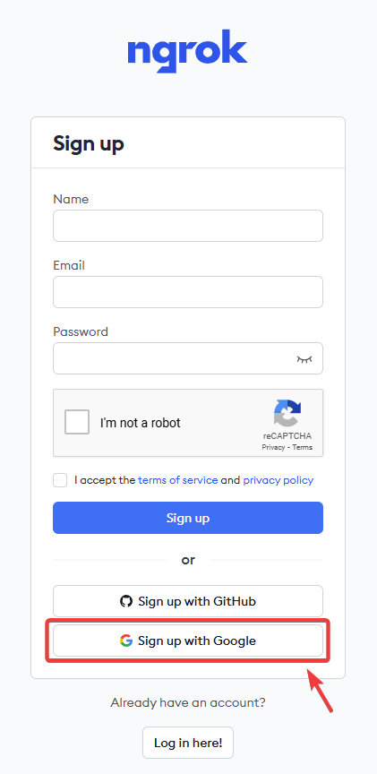

# IoT 초보를 위한 Flask 및 Ngrok 사용 웹 서버 구축 가이드

이 가이드는 Flask 및 Ngrok을 사용하여 온도 및 습도 데이터를 표시하는 웹 서버를 라즈베리 파이에서 설정하는 방법을 단계별로 설명합니다.  
해당내용은 생성형 인공지능(GenAI)인 챗지피티를 활용해 만든 커리큘럼입니다.  

## 1단계: 라즈베리 파이 및 DHT11 설정

### 1. 라즈베리 파이에 Raspbian 설치 (Windows 머신 사용)

- **필요한 재료**: 라즈베리 파이, microSD 카드 (32GB 권장), 전원 공급 장치, HDMI 케이블, 키보드, 마우스, 모니터, Windows PC.
- **단계**:
    1. <a href="https://www.raspberrypi.org/software/" target="_blank">라즈베리 파이 공식 다운로드 페이지</a>로 이동합니다.
    2. "Raspberry Pi Imager"를 다운로드하여 설치합니다. Windows용 설치 파일을 선택하십시오.
    3. Raspberry Pi Imager를 실행합니다.
    4. "Choose OS" 버튼을 클릭하고 "Raspberry Pi OS (32-bit)"를 선택합니다.
    5. "Choose SD Card" 버튼을 클릭하고 microSD 카드를 선택합니다.
    6. "Write" 버튼을 클릭하여 Raspbian OS를 microSD 카드에 설치합니다.
    7. 완료되면 microSD 카드를 라즈베리 파이에 삽입합니다.
    8. 라즈베리 파이를 모니터, 키보드 및 마우스에 연결하고 전원을 켭니다.
    9. 초기 설정을 완료합니다.

### 2. 한국어 언어 패키지 설치 및 설정

- **라즈베리 파이에서 터미널을 엽니다.**
- 터미널에서 다음 명령어를 실행하여 시스템을 업데이트 및 업그레이드 합니다:
    ```bash
    sudo apt update
    sudo apt upgrade
    ```

- 다음 한글 언어 팩을 추가합니다:
    ```bash
    sudo apt install fonts-nanum ibus ibus-hangul
    ```
    설치 중 여유공간을 확인 후 설치 여부를 묻는다면 'Y'를 선택해서 설치를 진행합니다.  
- 언어 및 지역 설정을 아래와 같은 스크립트를 통해 설정합니다:
    ```bash
    sudo raspi-config
    ```
    - "Localisation Options"를 선택하고 "Change Locale"을 선택합니다.
    - 스페이스 바를 활용해서 "ko_KR.UTF-8 UTF-8"을 선택하고 "OK"를 클릭합니다.
    - "기본 로케일(Set Default Locale)"을 "ko_KR.UTF-8"로 설정합니다.

- 키보드 레이아웃을 변경합니다.  
여전히 'raspi-config'에 위치하고 있습니다.  
    - 'Localisation Options'로 이동합니다.  
    - 'Keyboard Layout'을 선택합니다.
    - 'generic 105-key PC' 또는 사용중인 특정 키보드 모델에 맞게 선택합니다.

- 입력 수단(Input Method)에 한글을 추가합니다:
    ```bash
    ibus-setup
    ```  
    위 스크립트를 실행하면 'IBus Preferences'라는 창이 열립니다.  
    - 'Input Method'라는 탭을 클릭한 다음
    - 'Add'를 클릭해서
    - 'Korean'을 선택한 다음에
    - 'Hangul'을 추가합니다.
    - 'General' 탭에서 'Keyboar Shortcuts'에 'Next input method'의 기본 설정을 오른쪽의 '...'눌러서 원하는 방식으로 바꾸고 'Apply'를 선택합니다. 참고로 저는 'Shift'키를 활용해서 'space'키와 함께 '한/영' 변경 키로 설정했습니다. 

### 3. DHT11 센서 연결 및 구성

- **필요한 재료**: DHT11 센서, 점퍼 와이어, 브레드보드.
- **배선**:
    - DHT11의 VCC 핀을 라즈베리 파이의 3.3V에 연결합니다.
    - DHT11의 GND 핀을 라즈베리 파이의 GND에 연결합니다.
    - DHT11의 데이터 핀을 라즈베리 파이의 GPIO4에 연결합니다.  


## 2단계: Flask를 사용한 웹 서버 설정

### 1. 라즈베리 파이에 Flask 및 Adafruit_DHT 설치

- 터미널을 열고 다음 명령어를 실행합니다:
    ```bash
    sudo apt update
    sudo apt install python3-pip python3-venv vim
    ```

- 프로젝트 디렉토리를 생성하고 가상 환경을 설정합니다:
    ```bash
    mkdir flask_app
    cd flask_app
    python3 -m venv flask
    source flask/bin/activate
    ```

- 가상 환경에 Flask 및 Adafruit_DHT를 설치합니다:
    ```bash
    pip install adafruit-circuitpython-dht Flask
    ```

### 2. Flask 애플리케이션 생성

**flask_app.py 생성 단계별 가이드**

- 라즈베리 파이에서 터미널을 엽니다.
- 프로젝트를 생성할 디렉토리에 위치했는 지 확인합니다. 예시에서는 'flask_app' 디렉토리에 위칙하고 있습니다.
- 해당 디렉토리에서 `flask_app.py`라는 새 Python 파일을 생성합니다:
    ```bash
    vim flask_app.py
    ```

- `flask_app.py` 파일에 다음 코드를 작성합니다:
    ```python
    # flask_app.py
    from flask import Flask, jsonify, send_from_directory
    import time
    import board
    import adafruit_dht

    app = Flask(__name__)

    # Initialize the DHT device, with data pin connected to:
    dhtDevice = adafruit_dht.DHT11(board.D4)

    def read_dht11():
        try:
            temperature_c = dhtDevice.temperature
            humidity = dhtDevice.humidity
            return temperature_c, humidity
        except RuntimeError as error:
            print(error.args[0])
            return None, None

    @app.route('/sensor_data', methods=['GET'])
    def get_sensor_data():
        temp, hum = read_dht11()
        if temp is not None and hum is not None:
            return jsonify({'temperature': temp, 'humidity': hum})
        else:
            return jsonify({'error': 'Failed to read sensor data'}), 500

    @app.route('/')
    def index():
        return send_from_directory('.', 'index.html')

    if __name__ == '__main__':
        app.run(host='0.0.0.0', port=5000)


    ```

- 파일을 저장하고 나옵니다: `Esc`, `:wq`, `Enter`.

### 3. HTML 템플릿 생성

- 같은 디렉토리에 `index.html`이라는 새 HTML 파일을 생성합니다:
    ```bash
    vim index.html
    ```

- `index.html` 파일에 다음 HTML 코드를 작성합니다:
    ```html
    <!-- index.html -->
    <!DOCTYPE html>
    <html>
    <head>
        <title>Temperature and Humidity</title>
        <script>
            async function fetchData() {
                const response = await fetch('/sensor_data');
                const data = await response.json();
                if (response.ok) {
                    document.getElementById('temperature').textContent = data.temperature + ' °C';
                    document.getElementById('humidity').textContent = data.humidity + ' %';
                } else {
                    document.getElementById('temperature').textContent = 'Error';
                    document.getElementById('humidity').textContent = 'Error';
                }
            }

            setInterval(fetchData, 2000);
        </script>
    </head>
    <body onload="fetchData()">
        <h1>Temperature and Humidity</h1>
        <p>Temperature: <span id="temperature">Loading...</span></p>
        <p>Humidity: <span id="humidity">Loading...</span></p>
    </body>
    </html>

    ```

- 파일을 저장하고 나옵니다: `Esc`, `:wq`, `Enter`.

### 4. Flask 애플리케이션 실행

- `flask_app.py` 파일이 있는 디렉토리로 이동합니다:
    ```bash
    cd ~/flask_app
    source venv/bin/activate
    ```

- Flask 애플리케이션을 실행합니다:
    ```bash
    python3 flask_app.py
    ```

- 동일 네트워크의 브라우저에서 `http://<raspberry_pi_ip>:5000` 또는 `http://localhost:5000`을 사용하여 웹 서버에 접속합니다.

## 3단계: Ngrok을 사용하여 웹 서버에 접근 가능하게 만들기

### 1. Ngrok 가입 및 인증 토큰 받기

1. [Ngrok 웹사이트](https://dashboard.ngrok.com/signup)로 이동하여 무료 계정을 만듭니다.  
가급적 '구글계정'을 활용해 회원가입을 합니다.  

2. 회원가입 후 계정에 로그인하여 대시보드로 이동합니다.
3. 대시보드에서 "Your Authtoken" 섹션을 찾습니다.
4. 표시된 인증 토큰을 복사합니다.

### 2. 라즈베리 파이에 Ngrok 설치

- Ngrok을 공식 웹사이트에서 다운로드합니다:
    ```bash
  curl -s https://ngrok-agent.s3.amazonaws.com/ngrok.asc \
	| sudo tee /etc/apt/trusted.gpg.d/ngrok.asc >/dev/null \
	&& echo "deb https://ngrok-agent.s3.amazonaws.com buster main" \
	| sudo tee /etc/apt/sources.list.d/ngrok.list \
	&& sudo apt update \
	&& sudo apt install ngrok
    ```

### 3. Ngrok 설정

- Ngrok을 인증 토큰으로 인증합니다:
    ```bash
    ngrok config add-authtoken YOUR_AUTH_TOKEN
    ```

- Flask 애플리케이션을 전달하기 위해 Ngrok을 실행합니다:
    ```bash
    ngrok http 5000
    ```

- 생성된 공개 URL을 기록합니다 (예: `http://abcd1234.ngrok.app`).

### 4. 원격으로 웹 서버에 접근

- 생성된 Ngrok URL을 브라우저에 입력하여 원격으로 Flask 웹 서버에 접속하고 센서 데이터를 확인합니다.
- 해당 페이지에서 '마우스 오른쪽'을 눌러 '이 페이지의 QR코드 생성'을 선택하여 QR코드를 생성한 다음 모바일 기기를 통해 해당 페이지에 접속합니다.    
  

이 단계들을 따르면 Flask를 사용하여 라즈베리 파이에서 웹 서버를 설정하고, Ngrok을 통해 원격에서 접속할 수 있게 됩니다. 이 커리큘럼은 초보자를 위한 IoT 기반 스마트 농장 모니터링 시스템을 구축하는 과정을 안내합니다.
